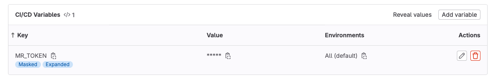

Merge requests like gitlab is naming them or pull requests like github is naming them are a great feature in my opinion.
They summarize the changes done, to reach a dedicated goal and enable us to discuss and share the changes done.
But what if you or somebody else forgot to create a merge request for your development branch?
Or you run GitOps and need to promote your environment through different branches, do you want to create and merge manually?

There is a solution for this challenge, the merge request can be created via you CI in this case via Gitlab-CI.

## Preparation

To start we need to prepare the repository.
A GitLab access token with api access permission and the role necessary, mostly developer, to create the merge request, is needed.
This token then needs to be available in GitLab CI variable which can be easiest done with glab.
The name of the variable is `MR_TOKEN`, the token itself has to be pasted into the command.

```bash
glab variable set MR_TOKEN <Put your token here>  -m
```

Alternative the ci variable can be set via the UI.
Both option shall end with a picture similar to the this one.


If you use the environment feature of gitlab adapt the environment parameter of the CI variable.

## The CI job

After we have the CI variable `MR_TOKEN` we can utilize it in a CI job.
For the purpose of this CI-Job I use the gitlab cli [glab](https://gitlab.com/gitlab-org/cli), which make it very easy to interact with the gitlab API via command line or CI-job.
Beside the binary itself the project also provides a container image which we use here, see line 3.
The container start with a glab entrypoint which we need to overwrite to execute a script within the CI-job.
Within the script block the git repository needs to be configured, this is necessary for glab to work.
Then it is straight forward, authentication with glab to the gitlab api while using the `MR_TOKEN` variable and the glab command similar to one you can execute on your local shell, to create merge request.

That is it!



The code be found on [https://gitlab.com/tiflor/auto_mr_creation_demo/](https://gitlab.com/tiflor/auto_mr_creation_demo/-/blob/main/gitlab-ci/create_mr.yml?ref_type=heads).

## embedding it into `.gitlab-ci.yml`

I like to have my jobs in dedicate files. That then needs to be included into the `.gitlab-ci.yml`, which can be done in the following way.

```yml
include:
  - local: 'gitlab-ci/create_mr.yml'

stages:
  - create_mr
```

The job also need to run in a dedicated stage which is named `create_mr`.
